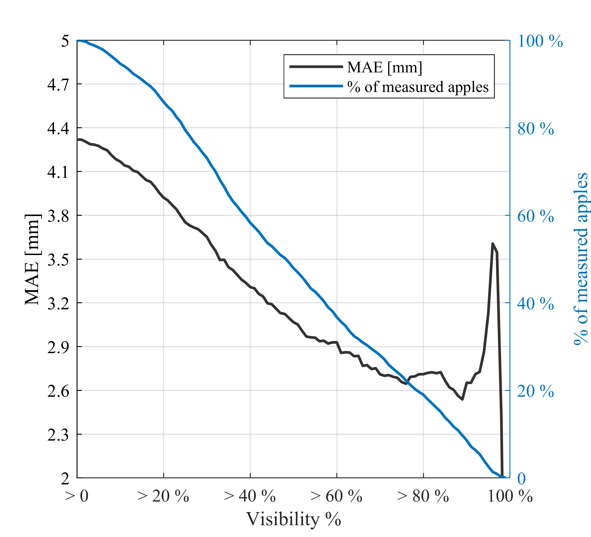
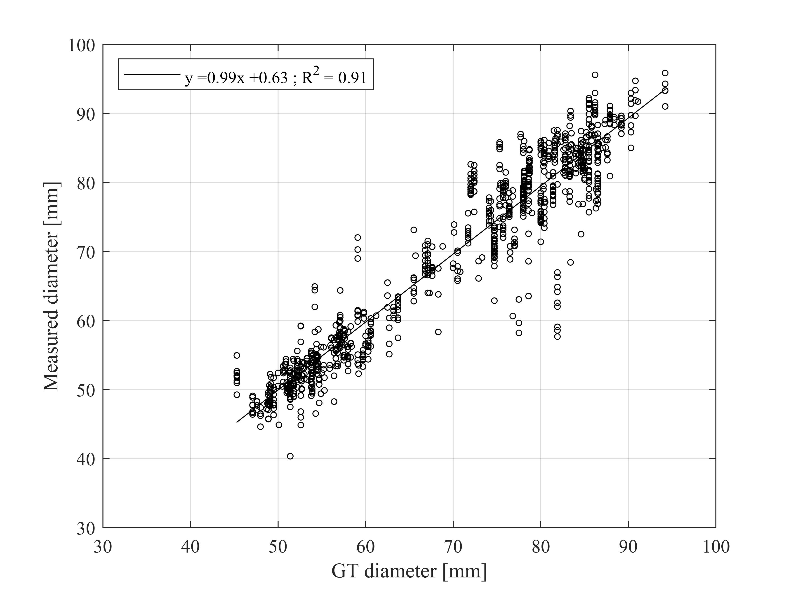

# A deep learning method to detect and measure partially occluded apples based on simultaneous modal and amodal instance segmentation

<br/>


## Summary
We provide a deep-learning method to better estimate the size of partially occluded apples. The method is based on ORCNN (https://github.com/waiyulam/ORCNN) and sizecnn (https://git.wur.nl/blok012/sizecnn), which extended Mask R-CNN network to simultaneously perform modal and amodal instance segmentation.


The amodal mask is used to estimate the fruit diameter in pixels, while the modal mask is used to measure in the depth map the distance between the detected fruit and the camera and calculate the fruit diameter in mm by applying the pinhole camera model.


## Installation
See [INSTALL.md](INSTALL.md)


## Getting started
To use this method, please follow this procedure: <br/>

### Download the dataset
We have made our image-dataset (**PApple_RGB-D-Size dataset**) publicly available, which can be downloaded in the following [link](http://gofile.me/6QM79/MIyx6MCSO). 

It consists of 3925 RGB-D images of Fuji Apple Trees, including modal and amodal segmentation masks and diameter ground-truth of each annotated apple (15335 annotated apples). 

### Train
Execute Train_AmodalFruitSize.py to train the network:
```
python trainval_net.py \
    			--num_iterations $MAX_NUM_OF_ITERATIONS --checkpoint_period $CHECKPOINT_PERIOD \
			--eval_period $EVAL_PERIOD  --batch_size $BATCH_SIZE \
			--learing_rate $LEARNING_RATE  --LR_decay $WEIGHT_DECAY \
			--experiment_name $OUTPUT_FOLDER_NAME   --dataset_path $DATASET_DIRECTORY \
			--batch_size_per_image $BATCH_SIZE_PER_IMAGE 
```
example:
```
python Train_AmodalFruitSize.py --num_iterations 4000 --checkpoint_period 500 --eval_period 500  --batch_size 4  --learing_rate 0.02  --LR_decay 0.0001 --experiment_name "trial_01"  --dataset_path "/home/user/datasets/PApple_RGB-D-Size_dataset/data"  --batch_size_per_image 512
```

### Test
If you want to evlauate the detection performance of a pre-trained model on our set
Execute AmodalFruitSize_val_test_evaluation.py to test the network:
```
python AmodalFruitSize_val_test_evaluation.py \
                --experiment_name $EXPERIMENT_NAME  --test_name $TEST_ID_NAME \
                --dataset_path  $DATASET_DIRECTORY  --split $DATASET_SPLIT \
                --weights  $WEIGHTS_FILE  --focal_length $CAMERA_FOCAL_LENGTH \
                --iou_thr $INTESECTION_OVER_UNION  --nms_thr $NON_MAXIMUM_SUPRESION \
                --confs  $MINIMUM_CONFIDENCES_TO_TEST
```
example:
```
python AmodalFruitSize_val_test_evaluation.py  --experiment_name 'trial01'  --test_name 'eval_01'  --dataset_path '/home/user/datasets/PApple_RGB-D-Size_dataset/data'  --split  'test'  --weights '/home/user/codes/Amodal_Fruit_Sizing/output/trial01/model_0001999.pth'  --focal_length  5805.34  --iou_thr 0.5  --nms_thr 0.1  --confs '0.0,0.05,0.1,0.15,0.2,0.25,0.3,0.35,0.4,0.45,0.5,0.55,0.6,0.65,0.7,0.75,0.8,0.85,0.9,0.95,0.99'
```

### Inference / Demo
If you want to run the detection and sizing method on your own images with a pre-trained model, [download the pretrained model](http://gofile.me/6QM79/bPT2tCNq9) or train your own models at first, and then execute AmodalFruitSize_inference.py: 
```
python AmodalFruitSize_inference.py \
                --experiment_name $OUTPUT_FOLDER_NAME  --dataset_path  $DEMO_DATA_DIRECTORY \
                --test_name $FOLDER_FROM_THE_DATASET_CONTAINING_THE_IMAGES  --weights  $WEIGHTS_FILE \
                --nms_thr $NON_MAXIMUM_SUPRESION  --confs  $MINIMUM_CONFIDENCES_TO_TEST
```
example:
```
python AmodalFruitSize_inference.py  --experiment_name 'demo' --dataset_path "./demo" --test_name 'demo_data'  --weights  './output/trial01/model_0002999.pth'  --nms_thr 0.1  --conf 0
```
Note: To run the AmodalFruitSize_inference.py code the reader can use the images provided in './demo/demo_data'. The pre-trained weights can be downloaded in the following [link](http://gofile.me/6QM79/bPT2tCNq9).

## Results
Since the percentage of visibility can be automatically estimated by using modal and amodal masks, we evaluated the sizing performance at different fruit visibility levels:

<p align="center">


 
Results when measuring apples automatically detected with a visibility higher than 60%:

|                  | Green apples		 | Ripe apples			 | Green + Ripe apples		 |
|------------------|:--------------:|:--------------:|:---------------------:|
| MAE (mm)         |   2.05    	   | 3.34       		  |        2.93			        |
| MBE (mm)         | -0.54       		 | -0.02       		 |       -0.19			        |
| MAPE (%)         | 3.79       		  | 4.27       		  |        4.19			        |
| RMSE (mm)        | 2.80       		  | 4.59       		  |        4.14			        |


Linear correlation between the ground truth (GT) diameter and the automatically measured diameter of apples detected in the test set with a visibility higher than 60%:    
<p align="center">

Qualitative results. Green values correspond to the ground truth and white values are the measures automatically estimated with the present method.


## Pretrained weights

| Backbone         		| Dataset  | Weights													                                                                                      |
|---------------------------------|----------|-----------------------------------------------------------------------------------------------------------| 
| ResNext_101_32x8d_FPN_3x	| PApple_RGB-D-Size | [model_0002999.pth](http://gofile.me/6QM79/bPT2tCNq9)                                                     |

## License
Our software was forked from sizecnn (https://git.wur.nl/blok012/sizecnn), which was forked from ORCNN (https://github.com/waiyulam/ORCNN), which was forked from Detectron2 (https://github.com/facebookresearch/detectron2). As such, our CNN's will be released under the [Apache 2.0 license](LICENSE). <br/>


## Citation
Please cite our research article or dataset when using our software and/or dataset: 
```
@article{XXXXX2022,
   title = {Looking Behind Occlusions Through Amodal Segmentation for Robust On-tree Fruit Size Measurement},
   author = {Author01 and Author02 and Author03 and ... and AuthorNN},
   journal = {YYY},
   volume = {ZZZ},
   pages = {TTT},
   year = {YYY},
   doi = {asdasd},
   url = {asdasd},
}
```

